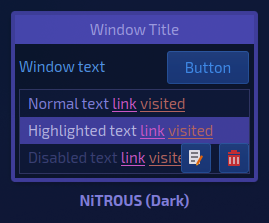
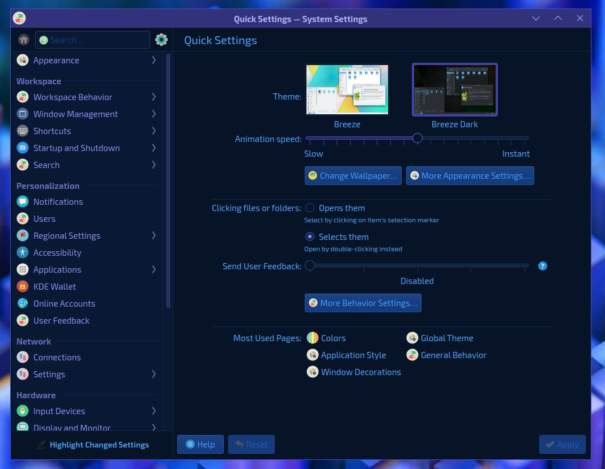
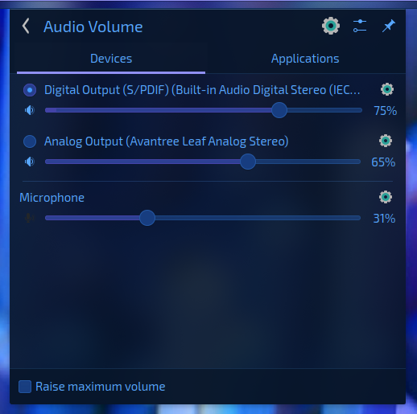
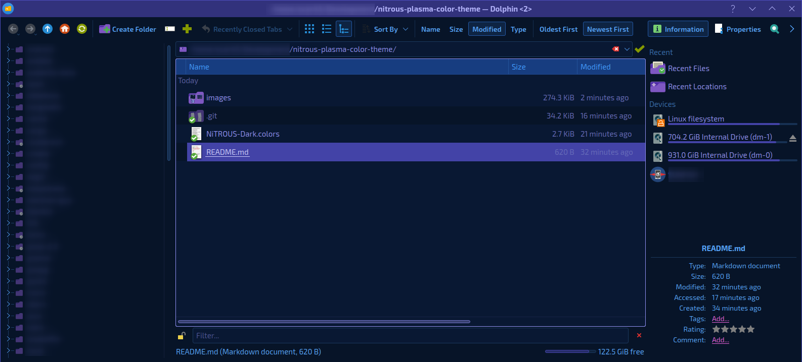

<h1 align="center">NiTROUS (Dark) KDE Plasma Theme</h1>

A dark color theme for KDE Plasma inspired by futuristic holo tech, comprised mainly of a purple and blue palette, with pink accents.

▰
 
<em><small>designed by</small></em> <a href="https://george.merloc.co" title="Visit my website">George Merlocco 👨🏻‍💻 (scar45)</a>
 
<em><small>published by</small></em> <a href="https://nitrous.cloud" title="Visit nitrous.cloud">NiTROUS Cloud</a> 💨

---

## Installation

1. Launch **System Settings** ⇒ **Global Theme** ⇒ **Colors**

1. Click the **Get New Color Schemes...** button towards the bottom-right area

1. Search for **nitrous** and install the one from **scar45**

1. Ensure that your current color scheme is set appropriately

1. (Optional) Set **Breeze** as _Application Style_ (including GTK) theme to ensure proper color matching

### OR

1. Visit NiTROUS-Dark in the [KDE Store](https://store.kde.org/p/1941965) and download the `NiTROUS-Dark.colors` file

1. Launch **System Settings** ⇒ **Global Theme** ⇒ **Colors**

1. Click the **Install from File...** button towards the bottom-right area

1. Browse to the `NiTROUS-Dark.colors` file you downloaded from Pling/KDE Store, and choose, then apply it

1. (Optional) Set **Breeze** as _Application Style_ (including GTK) theme to ensure proper color matching

## Preview

## Thanks!

If you'd like to support my work, please share + rate my extension in the [KDE Store](https://store.kde.org/p/1941965). You can also shoot me a bit of loot on [Ko-Fi](https://ko-fi.com/scar45) for which I'd be very appreciative of. Most of all though, I hope you enjoy using this theme. Cheers!

_P.S. If you enjoy this color theme, check out [nitrous.cloud](https://nitrous.cloud 'Visit nitrous.cloud') for the entire suite. I'm always trying to add more!_

---

.end
